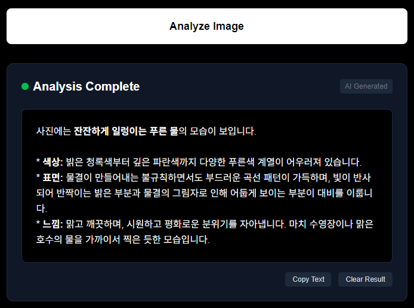

# AI Image Analyzer - ✨[바로가기](https://msa-image-analyzer-gemini.vercel.app)

## 🖼️ 메인화면 로고


## 📖 이미지 분석 중


## 💡 이미지 분석 결과


## 💿 환경 변수 (Vercel에 입력)

```
# MSA Brain-Gemini API URL
API_BASE_URL=https://msa-brain-gemini-173411279831.asia-northeast3.run.app/gemini/analyze_image
```

---

AI Image Analyzer는 Next.js 기반의 이미지 분석 웹앱입니다. 이미지를 업로드하고, 질문을 입력하면 AI가 이미지를 분석하여 마크다운 스타일로 결과를 제공합니다. 모바일 퍼스트, Vercel 스타일의 다크 UI를 적용하였으며, x-api-key를 통한 안전한 API 호출을 지원합니다.

## 주요 기능
- **이미지 업로드** 및 미리보기
- **질문 입력** (텍스트)
- **x-api-key** 입력 및 헤더 전달
- **AI 분석 결과** 마크다운(볼드/이탤릭) 스타일로 표시
- **Analyze 버튼** 내 스피너 및 로딩 UX
- **에러 발생 시 모달 팝업**
- **모바일 퍼스트 & 다크 UI** (Vercel 스타일)

## 사용 방법
1. 저장소 클론 및 의존성 설치
   ```bash
   git clone <repo-url>
   cd ai-image-analyzer
   npm install
   ```
2. `.env.local` 파일에 환경변수(x-api-key 등) 설정
3. 개발 서버 실행
   ```bash
   npm run dev
   ```
4. 브라우저에서 [http://localhost:3000](http://localhost:3000) 접속

## 폴더 구조
```
├── src/
│   └── app/
│       ├── api/
│       │   └── analyze/route.ts   # API 라우트 (x-api-key 프록시)
│       ├── page.tsx               # 메인 페이지 (UI/UX)
│       └── globals.css            # 글로벌 스타일
├── public/                        # 정적 파일
├── .env.local                     # 환경 변수
├── package.json
└── README.md
```

## API 연동 방식
- 클라이언트에서 입력받은 x-api-key를 서버 API 라우트로 전달
- 서버에서 외부 AI 이미지 분석 API로 x-api-key 헤더 포함 POST 요청
- 응답 결과를 마크다운 스타일로 가공해 클라이언트에 반환

## 기술 스택
- Next.js 15, React 19
- TypeScript
- Tailwind CSS (Vercel 스타일 다크 테마)

## 라이선스
MIT License
